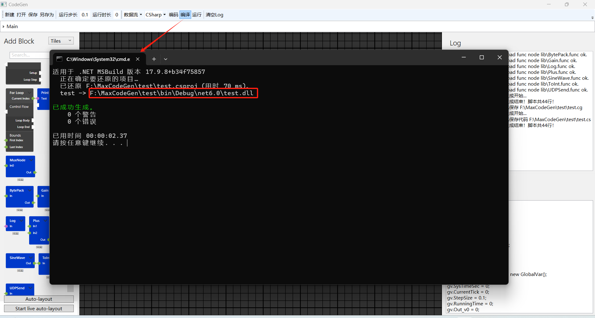

## 说明

MaxCodeGen项目是基于NodeNetWork项目的开源图形化编程、建模代码生成和编译运行平台。平台主要解决的问题是对标Labview、Simulink等图形化编程、建模应用。其中按过程流的编程代码生成对标Labview，按数据流的运算建模代码生成对标Simulink。平台的终极远景是打造社区维护的算子（或称函数）交易市场化的建模平台，让基于行业的仿真算法算子可以交易，有能力的人可以销售算子而不是完整的软件，打造基于算子的生态。

### 特点

1. 图形化拖拽代码生成（C#、C），编译运行（目前只支持编译C#），框架设计考虑了多种语言代码生成。
2. 自定义算子（或称函数）功能，可以文本方式客制化编辑算子，即定义图形块节点的输入、输出、参数、不同语言生成的对应代码。
3. 两种代码生成模式：按过程流的编程代码生成、按数据流的运算建模代码生成。满足业务编程和数学建模。

### 编译

需要Dotnet6 WindowsDesktop环境，VS2022编译ExampleCodeGenApp项目。

### 使用

启动ExampleCodeGenApp.exe

#### 主界面介绍

区域A：菜单和模块层级导航

区域B：B算子模块表

区域C：模块布局连接编辑区

区域D：操作日志和生成代码预览

#### 搭建业务

（注意：如下说明按数据流代码生成模式介绍，过程模式的代码生成就是Main节点所直接或间接连接的节点进行代码生成，此处不演示了）

如上图所示，Main模块是默认的，不能删除。

区域B找到SineWave模块、Gain模块拖入区域C，然后连线，让SineWave输出连接到Gain模块的输入。

可以双击模块下发的设置弹出如下模块属性设置界面，然后进行参数配置。

#### 生成代码

菜单中按0.1秒周期、数据流模式、CSharp代码，点击编码，Log将打印生成代码情况，代码预览将出现生成的代码文件。

只有文件已经保存过了，才会在点击编码按钮后在cg文件所在目录生成对应cs代码文件。

#### 编译和运行

（需要Dotnet6 SDK环境）

点击编译，将在cg文件所在目录生成对应csproj的dotnet项目文件并编译项目，此时目录下的对应cs文件被编译到Debug目录下输出可执行文件。

再点击运行将运行可执行文件，此处可见偏移2、放大2倍的Sine值按运行步长0.1秒打印。

如果要生成C语言的可执行文件，则在生成代码后，找到目录下的.c文件，手动进行编译，比如要编译成当前win平台的可执行文件，则可以使用vs build命令行定位到该目录，执行生成可执行文件命令： cl test.c

#### 制作客制化模块

在exe所在目录下，有个lib文件夹，里面有默认的多个算子文件（func格式），可以参考进行制作自定义的算子文件。

算子文件采用yml格式，定义说明如下。

FuncName，模块名称。

InConfigDic，多条输入信号的配置字典，每个信号为一条输入，输入具有类型、维度（维度为0为普通变量，大于0为多维变量、小于0为指针）、初值。

OutConfigDic，和InConfigDic一样，但是是输出。

ParamDic，和InConfigDic一样，但是是模块的设置参数而不是可以连接的端口。

ScriptTempDic，多种语言的代码生成模板，其中方括号内为InConfigDic、OutConfigDic、ParamDic的变量名。

ScriptAssemblyDic，多种语言的引用头文件（包括文件名、库名）定义表。

## 路线
目前处于阶段1。

阶段2：修复界面交互BUG、优化交互。
1. 重新打开保存的cg文件生成代码不正确
2. 补充更详细的文档说明
3. 某些模块之间还不支持连线，连线的数据类型处理还需要进一步优化
4. 运行时缺少数值展示、数据曲线展示等功能
5. 连线目前只有贝塞尔曲线，希望能够有直线效果，让布局交互更友好

阶段3：补充丰富算子库（对标Simulink、Labview常用模块，用于满足常用业务建模）。
阶段4：完善更多语言代码生成，如Lua、Python、CPP。
阶段5：集成更多语言代码编译运行。
阶段6：编译和数据类型等警告能在图上面具有交互提示。
阶段7：仿真运行方式具有接口，能够与图进行交互。
阶段8：打造社区维护的算子交易市场化的建模平台。

## 贡献
欢迎在 Gitee / GitHub 页面上提交错误报告、补丁、功能请求、拉取请求。

### 捐赠

通过加密货币TokenPocket链接0x9fa235dF11f2682a8a29Ebc3bB58b77E562A03FD

通过支付宝AliPay扫码

## License

This library is licensed under the Apache License 2.0. (See [choosealicense.com/licenses/apache-2.0](https://choosealicense.com/licenses/apache-2.0) for a brief summery)  
A copy of this license is included in the repository under LICENSE.